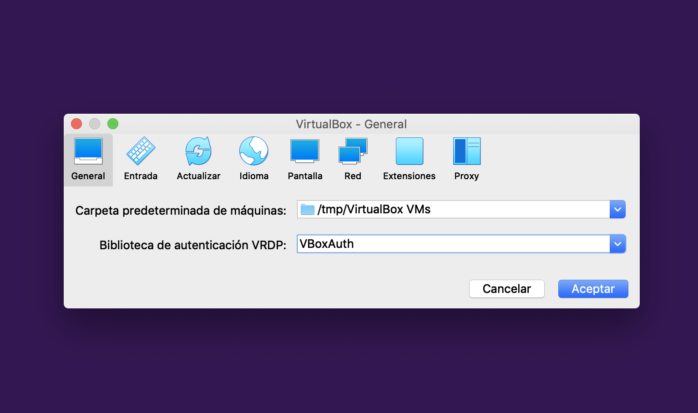
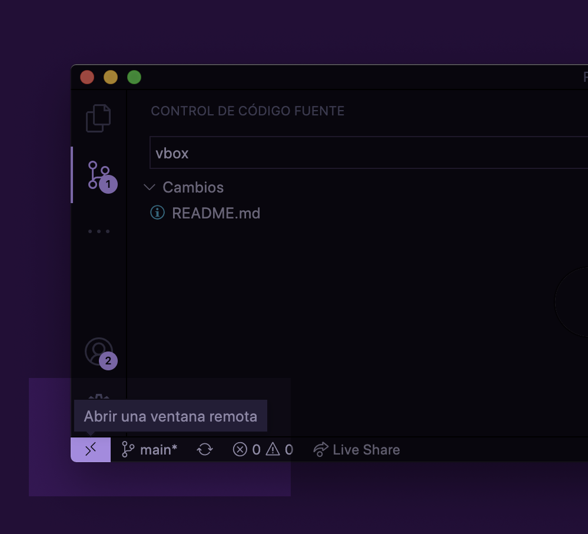

# Cómo trabajar con máquinas virtuales

# Brew

La forma más sencilla de instalar paquetes en Mac sin necesidad de permisos de administrador es utilizar brew.
El problema es que cualquier paquete ocupa un espacio que restará de los escasos 5 GB de los que disponemos. Por ello, podemos instalar Brew en una ubicación en la que sí que tenemos espacio suficiente: sgoinfre.

Para crear tu carpeta en sgoinfre:
````
mkdir -p /sgoinfre/students/$USER/
chmod -R 700 /sgoinfre/students/$USER/
````
Para instalar brew y configurar sgoinfre como carpeta por defecto para las instalaciones:
````
curl -fsSL https://raw.githubusercontent.com/bazuara/42madrid_homebrew_sgoinfre/master/install.sh | zsh
````
Para instalar cualquier paquete con brew:
````
brew install python3
...
brew install <paquete>
````

# Vagrant

Vagrant permite descargar máquinas virtuales preconfiguradas para su uso inmediato.
La gran ventaja es que con un par de comandos, tenemos entornos virtuales funcionando.
El inconveniente es que cada máquina virtual ocupa una cantidad de espacio que no nos permiten usar __en principio__.

Pero para eso tenemos una solución:

 - Comprobamos que Vagrant y Virtualbox están actualizados en el MSC
 - Ejecutamos:
````
rm -rf ~/.vagrant* 
mkdir -p /goinfre/$USER/.vagrant.d
ln -s /goinfre/$USER/.vagrant.d ~/.vagrant.d
vagrant plugin expunge --reinstall --force
````

Debemos configurar Virtualbox para que las máquinas se instalen en una carpeta en la que dispongamos de suficient espacio.

En 42 hay tres formas de ampliar nuestros 5 GB:
- Comprar otros 5 GB en la store.
- Utilizar goinfre/ o sgoinfre/
    - goinfre no tiene límite de espacio pero se borra en intervalos impredecibles.
    - sgoinfre nos permite utilizar 15 GB pero si nos sobrepasamos, se borran todos los datos. Usar con precaución.
- /tmp es una carpeta local que utiliza todo el disco duro, por lo que disponemos de 1TB de espacio.
    El problema es que los archivos se borran si no los utilizamos durante un tiempo determinado (3 días por defecto). Por lo tanto: todos los archivos que queráis conservar, utilizadlos desde las carpetas compartidas y haced commits regulares a un repositorio remoto.



Las máquinas de Vagrant crean una carpeta compartida en el disco duro de la máquina virtual.
[https://www.vagrantup.com/docs/synced-folders](https://www.vagrantup.com/docs/synced-folders)


# Docker

Docker permite levantar máquinas virtuales ligeras porque comparte los recursos del sistema físico. En 42 Madrid tenemos una versión de 2019 de Docker porque el staff no sabe actualizarlo a la versión más reciente.
Por lo tanto, para hacer que funcione tenemos que seguir los siguientes pasos:

- Desinstalar Docker y reinstalarlo desde el MSC.
- Configurar Docker para que descargue los contenedores en /goinfre:

    Descargamos 42 Toolbox
    ````
    git clone https://github.com/alexandregv/42toolbox.git ~/.42toolbox
    ````
    Cada vez que queramos iniciar Docker:
    ````
    yes | bash ~/.42toolbox/init_docker.sh
    ````

### Ejemplos de uso de Docker

Para lanzar una máquina virtual (sin entorno de escritorio) con la carpeta actual compartida en la máquina virtual:

```
docker run  -it \
            --mount type=bind,source=$PWD,target=/workspace \
            --workdir=/workspace \
            --name=ubuntu \
            ubuntu bash
```

- it: para que se ejecute en modo interactivo.
- --mount: para montar la carpeta actual en la máquina virtual, en la ruta /workspace.
- --workdir: para que la carpeta actual sea la carpeta de trabajo de la máquina virtual.
- --name: nombre del contenedor
- ubuntu: imagen a lanzar
- bash: comando a ejecutar en la máquina virtual.

Si queremos abrir puertos para poder lanzar un servidor u otro servicio, podemos hacerlo con un comando:
```
docker run  -it \
            -p 80:80 \
            --mount type=bind,source=$PWD,target=/workspace \
            --workdir=/workspace \
            --name=ubuntu \
            ubuntu bash
```

Cambiando 80:80 por los puertos EXTERIOR:INTERIOR que queremos abrir. Esto nos permitiría acceder por ssh a la máquina o levantar servicios web y entrar desde el navegador.

### Integrando Docker con VS Code

Visual Studio Code nos permite conectarnos por ssh a un contenedor de forma transparente para trabajar en un entorno Linux con permisos de administrador. Para ello, debemos instalar la extesión [Remote Containers](https://marketplace.visualstudio.com/items?itemName=ms-vscode-remote.remote-containers).

- Abrimos en VSCode la carpeta del proyecto en el que queramos trabajar:
- Ejecutamos en la consola el siguiente comando:
```
cat << EOF
FROM debian:bullseye
RUN apt-get update && apt-get install -y \
    curl nginx make git vim man net-tools gcc python3 python3-pip
EOF > Dockerfile
```

Todos los paquetes que añadamos al Dockerfile serán persistentes. En cambio, si después instalamos cualquier otro paquete durante la ejecución del contenedor, perderemos los cambios al cerrarlo.

```
docker build -t <nombre> .
```
Para ejecutarla:
```
docker run  -it \
            --mount type=bind,source=$PWD,target=/workspace \
            --workdir=/workspace \
            --name=ubuntu \
            <nombre> bash
```

El dockerfile del ejemplo instala Debian. Podemos elegir otra distribución. Para instalar programas, añádelos a la línea junto a ``curl nginx make ...``

- Hacemos click en la esquina inferior izquierda de VSCode

- Hacemos click en "Reopen in Container" y elegimos "From Dockerfile"

De ahora en adelante, podremos trabajar en el entorno linux que queramos.
